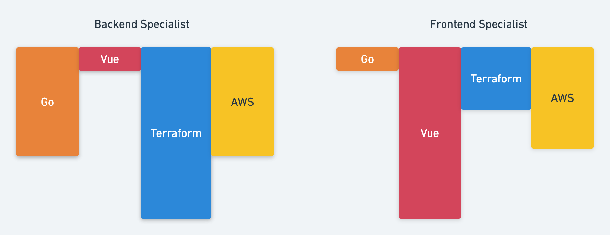

# Platform Assessment for Junior Engineers

### Contents
- [Welcome](#welcome)
- [The Platform Team](#the-platform-team)
- [Success in Role](#success-in-this-role)
- [Challenge](#challenge)

# Welcome 
😀
If you are reading this, congratulations you are a candidate for the platform team!

We are so glad you are here and can't wait to find out if our team and this work is a great fit for you and the team.

This repo is designed to help us determine the technical part of that.

# The Platform Team
Our team is made up of "hands on keyboard" folks and each member is expected to wear multiple hats.

Our scope is to build a globally scalable IoT solution that meets local regulations, security compliance,
ultra high performance and uptime, and enables brands to build world class device experiences.

This team will be high challenge and high growth, and requires great time management to make your 40 hours count.

## Team Values
- We are big believers in P&G's [PVP](https://us.pg.com/policies-and-practices/purpose-values-and-principles/), and proud to practice them
- Kindness and honesty, your co-workers and partners are human beings.
- Always learning(curiosity), most team members pair program 10-25% of the time, 
 every deliverable is an opportunity to feed into team knowledge.
 - Ownership, you are given areas of responsibility and expected to own those areas. Pushing excellence and asking for help when needed.
 
If you strongly disagree with any of the above, you likely won't be happy on our team. No hard feelings!

# Success in this role
🚀
Being 'M' Shaped or full stack.  If you've heard of ['T-Shaped'](https://chiefexecutive.net/ideo-ceo-tim-brown-t-shaped-stars-the-backbone-of-ideoaes-collaborative-culture__trashed/), this builds on the idea of being collaborative across disciplines but also build a depth of skill in not one but many different areas.

Our stack comprises [golang](https://golang.org/) services, 100% infrastructure as code with [terraform](https://www.terraform.io/docs/providers/aws/index.html), running in [AWS](https://aws.amazon.com), with dashboards in [vue.js](https://vuejs.org/). If you haven't heard of any or all of these, that's ok!

On our team you will be given a lot of autonomy and freedom, but ownership of deliverables is expected.
Problem domains will be lightly defined and you will be expected to dig, challenge and be challenged by yourself/teammates/vendors/users/etc., and push to deliver excellent solutions.

This work style isn't for everyone, and that's ok!

 # Challenge
 🏂
 We provide you the following:
 - An AWS account to test with
 - As much time as you need (most folks return this within a 1-2 weeks)
 - An open back and forth with any questions or concerns you have
 
 ## Success looks like the following:
 - Build two (2) API endpoints using Lambda functions written in Go (you can store this code in the `functions` directory).
    - Endpoint 1: PUT updateUser, with the following custom attributes.
        - Hogwarts house in camelCase (hogwartsHouse), a string / enum value with options of (Gryffindor, Slytherin, Ravenclaw, Hufflepuff)
        - Updated at in [ISO-8601](https://en.wikipedia.org/wiki/ISO_8601) Datetime camelCase (updatedAt), a string date format. (for reference we like 2020-04-14T13:13:13+00:00)
        - Store these attributes in DynamoDB
   - Endpoint 2: GET getUser and will return email, hogwartsHouse, and lastUpdated
- Both of these need to live at https://YOURURL/api/v1/users and should return a status code of 200 along with the 3 attributes
- All (or most!) of the infrastructure you provision should be deployed with Terraform (we've included the `infrastructure` directory with a `main.tf` file to get you started. 
- Set Environment variable CHALLENGE_URL to YOURURL
- Run E2E tests in Go (regardless of what language you ran you'll need to install Go for this)
- Upload your code to a github repo and send us the link!

### ⭐️ Bonus ⭐️:
 - Add in an auth system with a Cognito user pool provisioned with Terraform:
    - Set the Environment variable AUTH_HEADER to your authorization header ("basic BASE64USERPASS==" or "bearer JWTOKEN")
    - Uncomment the bonus tests in `main_test.go` and run your E2E tests
 
## Hard Rules:
- Using 3rd party libraries, google, stackoverflow, emailing questions to us for help; all perfectly acceptable and encouraged.
However you must write the code, copying gists is fine but someone else writing the code for you breaks our 'honesty' value. This needs to be your work. (Don't ask your friend to write it for you, and if you find a fork of this on the web, don't copy from it.)
- Infrastructure has to be provisioned with mostly terraform, only acceptable reasons why not will be that a terraform provider wasn't available.
- You can't change any existing code in the repo. Updating the tests to accept a 500 status code is clever... but not what we are looking for.
   